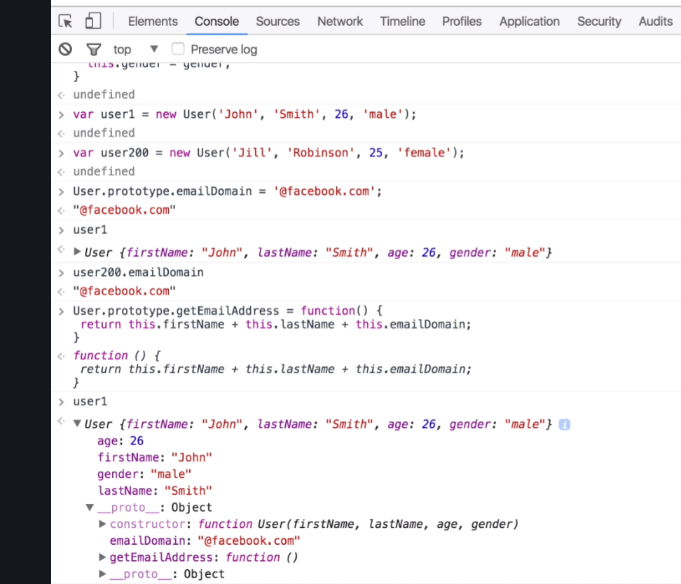

### Concept ###
    
    constructor function: 
         a constructor function is simply a function that creates an object class 
         and allows you to create multiple instances of that class very easily.

    ex:
```javascript

    //宣告一個方法並加上名稱
    //通常表示這不只是一個表達式,而是一個可建構物件的function
    function User (firstName, lastName, age, gender ) {
        this.firstName = firstName;
        this.lastName = lastName;
        this.age = age;
        this.gender = gender;
    };

    var user1 = new User('Knock', 'Yang', 18, 'male');//
    var user2 = new User('Jill', 'Robinson', 25, 'female');//


        
```

Chrome Example:


   
   

