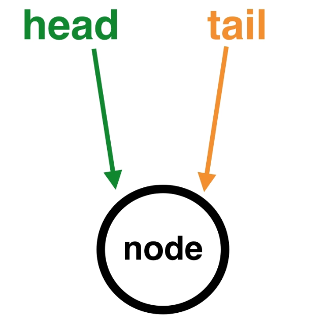
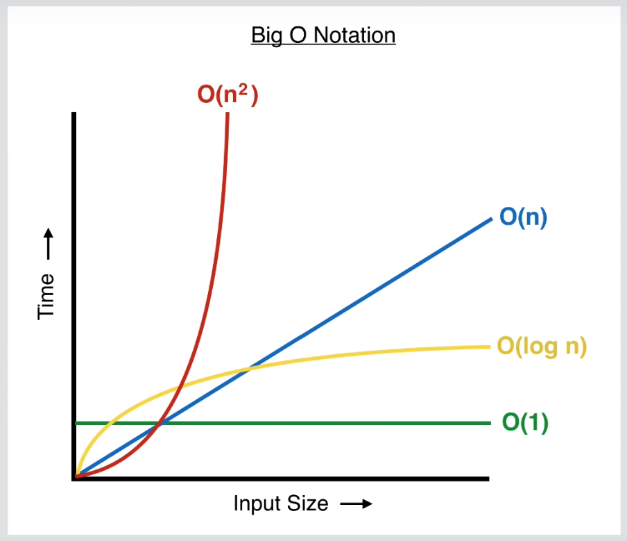
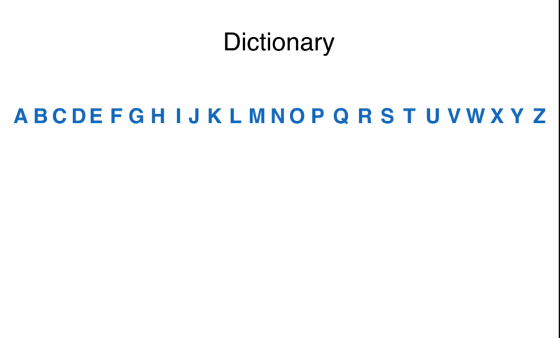
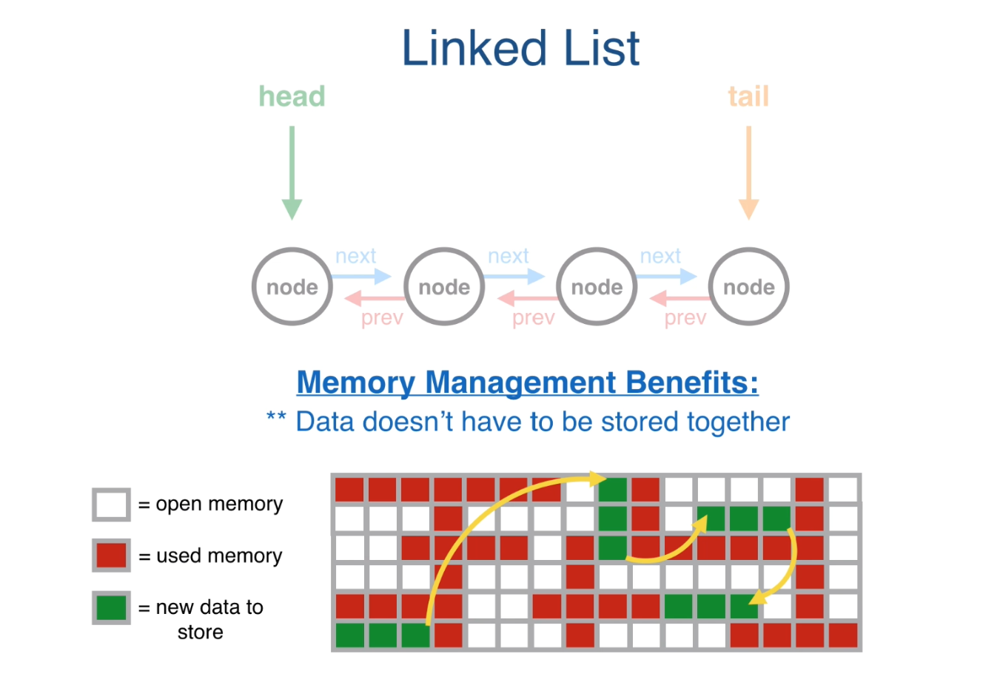

### Linked List and "Node" Constructo Functions ###

教學是使用一個 線上編輯器: [repl.it](https://repl.it)

## 如何建立第一個Linked List的Node呢? ###
就是建立一個Node並將head與tail都指向此Node,如下圖
為何要指向頭跟尾呢?
因要確保新增Node時,頭跟尾都存在指向指標


<h1>Linked List的時間複雜度</h1>

1. AddToHead/RemoveHead (AddToTail/RemoveTail) => O(1) 
   利用Head/Tail節點在作新節點的插入
2. Search => O(n)
   隨者列表大小作遍歷搜尋,是一個線性時間的變化
3. 


### Big O Notation & Runtime Source Code ###

Big O Notation 講述如何計算算法的複雜度

下圖為程式的複雜度:


```javascript
// Constant runtime - Big O Notation:  "O (1)"
function log(array) {
 console.log(array[0]);
 console.log(array[1]);
}
 
log([1, 2, 3, 4]);
log([1, 2, 3, 4, 5, 6, 7, 8, 9, 10]);
 
 
// Linear runtime - Big O Notation:  "O (n)"
function logAll(array) {
 for (var i = 0; i < array.length; i++) {
   console.log(array[i]); 
 }
}
 
logAll([1, 2, 3, 4, 5]);
logAll([1, 2, 3, 4, 5, 6]);
logAll([1, 2, 3, 4, 5, 6, 7]);
 
 
// Exponential runtime - Big O Notation: "O (n^2)"
function addAndLog(array) {
 for (var i = 0; i < array.length; i++) {
   for (var j = 0; j < array.length; j++) {
     console.log(array[i] + array[j]);
   }
 } 
}
 
addAndLog(['A', 'B', 'C']);  // 9 pairs logged out
addAndLog(['A', 'B', 'C', 'D']);  // 16 pairs logged out
addAndLog(['A', 'B', 'C', 'D', 'E']);  // 25 pairs logged out
 
 
// Logarithmic runtime - Big O Notation: O (log n)
function binarySearch(array, key) {
    var low = 0;
    var high = array.length - 1;
    var mid;
    var element;
    
    while (low <= high) {
        mid = Math.floor((low + high) / 2, 10);
        element = array[mid];
        if (element < key) {
            low = mid + 1;
        } else if (element > key) {
            high = mid - 1;
        } else {
            return mid;
        }
    }
    return -1;
}

```

Binary Search是比較省時間的算法
以下為Binary Search的算法演示:



### Linked List 是很好的資料結構 ###
因為它可以讓在**記憶體**中**不連續**的區塊產生**鏈結**


