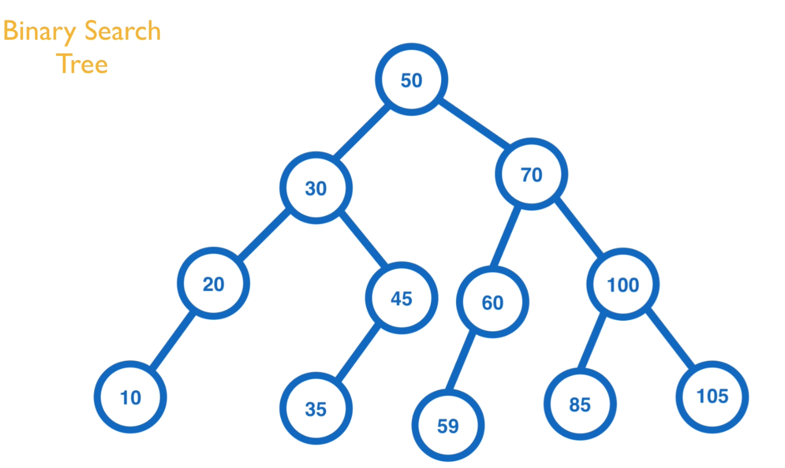
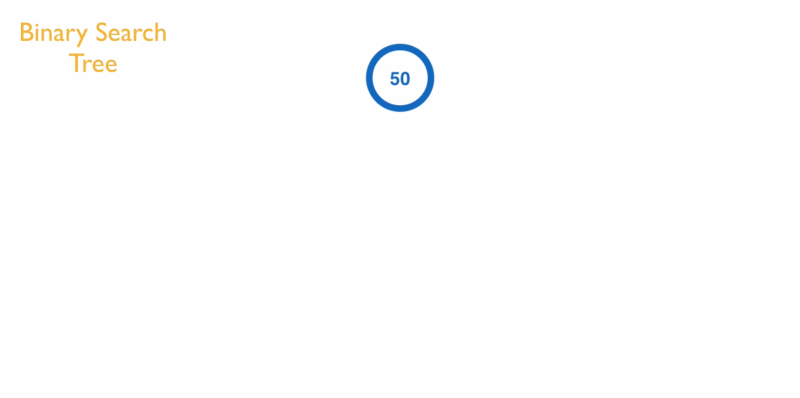
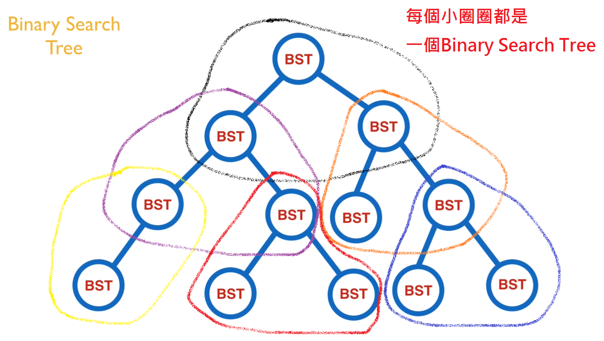
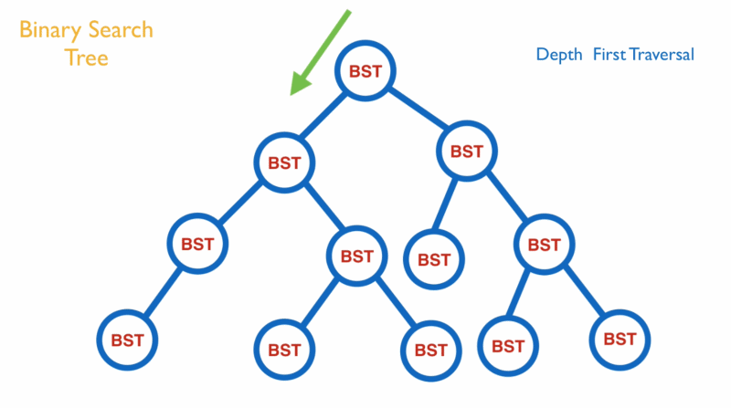
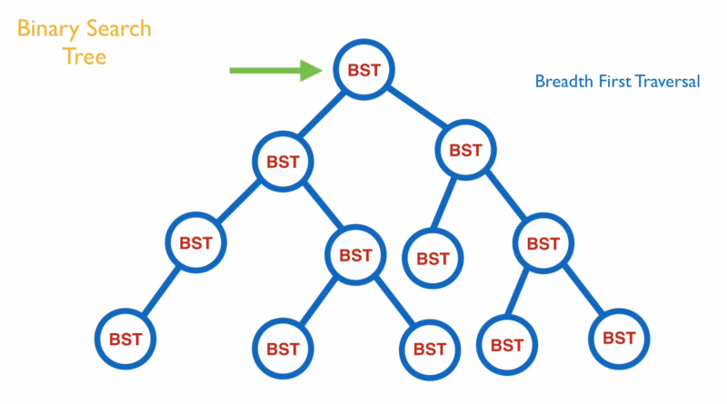
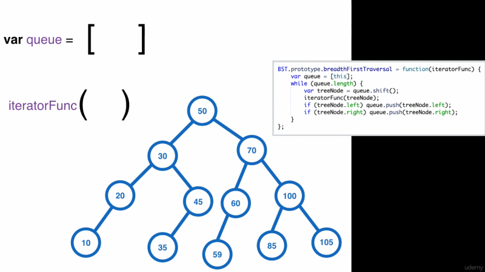

### Binary Search Tree ###

Binary Search Tree 是一個節點的集合,且每個節點之間有相互連結
但它有些規則
1. 每個節點都會有兩個子節點left和right,且每個節點會有某些數據或資料(有點像Linked List)
2. 所有left node的值必須小於或等於parent node的值且right node的值必須大於parent node的值

<h3>優點如下:</h3>

* 可快速處理insert和delete節點
* 時間複雜度是很不錯的;每次往下一層搜尋就少了一半的節點,假設有4000個節點,大概只要搜尋12次就可以找到( O(log n) )
* 是一個balanced tree, 若要只保留右邊來當linked List結構也很容易
* 可應用於Dictionary, Phone Book, Users Info, ...etc

範例:

* 假設目前有一個值50為root,然後要新增一個值30,那此值會新增到root的左邊node(因為比50小所以放左邊).
* 再新增一個值100,那此值會新增到root的右邊node(因為比50大所以放右邊).
* 再新增一個值75,那此值會移到50的右邊node,然後再來跟值100作比較,然後比100小,所以新增node到左邊node.
* 再新增一個值110,那此值會移到50的右邊node(因為比50大),然後再來跟值100作比較,然後比100大,所以新增node到右邊node.
* 再新增一個值105,那此值會移到50的右邊node(因為比50大),然後再來跟值100作比較,然後比100大,所以會移到值110作比較,然後因為比110小,所以新增node到左邊node.

### Binary Search Tree Traversal ###
如何遍歷所有的Binary Search Tree呢?
首先我們先觀察發現每個Tree都是由一個小Tree所構成
如圖所示:

<h2>Depth First Traversal **深度優先** </h2>

<h2>Breath First Traversal **廣度優先** </h2>

**以下為 Breath First Traversal 範例動畫**

