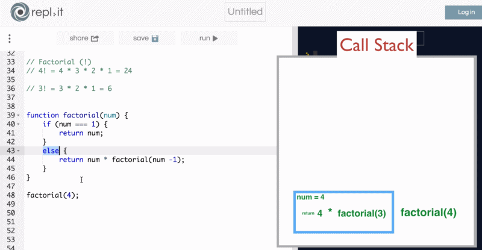

### Recursion ###
在講解深度優先與廣度優先時,必須先了解什麼是遞迴
因為這兩個演算都使用了遞迴來搜尋

<h5>Recursion的方法結構大致如下:</h5>
```javascript
function func(){

    if(/* base case */){
        return something;
    }
    else{
        //recursive case
        func();
    }
}

//Factorial (!)
// 4! = 4 * 3 * 2 * 1 = 24
// 3! = 3 * 2 * 1 = 6

function factorial(num){
    // 遞迴最終的結束條件
    if(num === 1){
        return num;
    }
    else{
        // 回傳當前的 num 乘 下一次的演算(此stack再呼叫下一個stack)
        // 4 * ( 3 * ( 2 * (1))) 
        return num * factorial(num - 1);
    }
}

console.log(factorial(4));// 24

```
下圖為演示上面的factorial方法執行過程的stack
