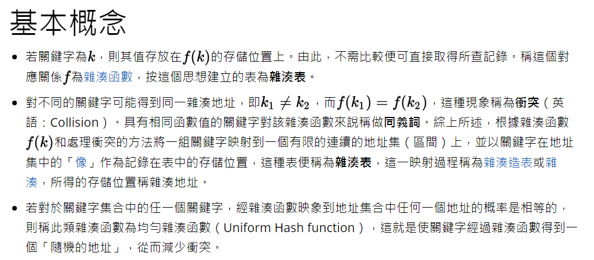
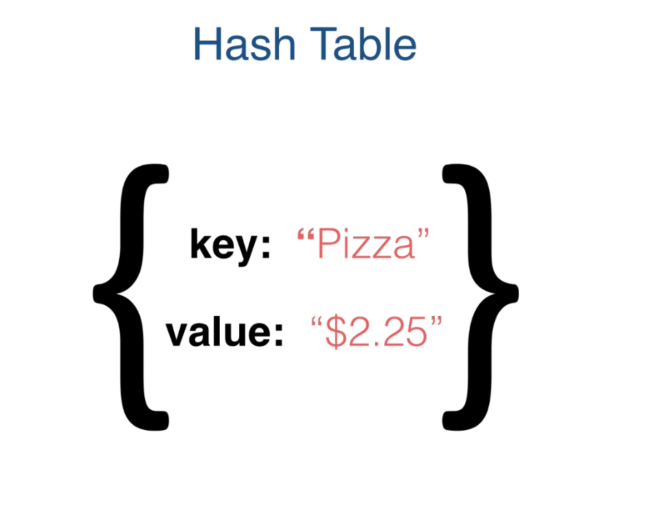
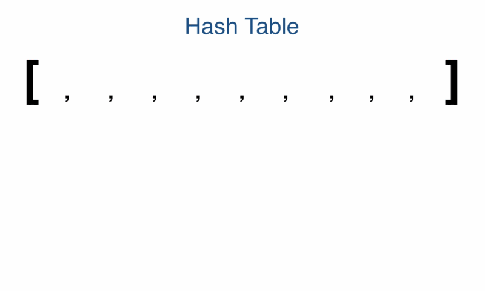

<h1> Hash Table </h1>

Hash table用來儲存資料的方式為用key關聯value
key為字串型態,value可為任意型態
Runtime: 
  * Lookup: O(1)
  * insertion: O(1)

**說明:**
在一個有序或無序的線性串列中，要尋找一筆資料通常要透過特定的搜尋資料與比對方式
，如果資料量很大，花費在搜尋上的時間成本也就隨之增大。

<strong>**hashing是一種鍵值與陣列索引的對應，我們透過特定的hashing函式，將指定的鍵值經過運算而得到一個hashing code，這個hashing code就當作是陣列的索引，資料就儲存在這個索引的位置中。**</strong>

要得到hashing code的運算方式有很多種，像是中間平方法、除法、摺疊法等等，**無論是哪種方式，都有可能在兩種不同鍵值，卻得到相同hashing code的情況，這個時候稱之為碰撞（collision）**，解決碰撞的方式也有許多種，最簡單的就是直接往hashing code所指向的位置之下一格作線性探測，直到找到空間為止，另外還有就是使用鏈結串列，當碰撞發生時，就將新的元素以鏈結的方式加在同一個位置的後面（這也是Java中的Hashtable類別所採取的方式），影響hashing效能的因性之後稱之為load factor，它的計算方式是hash table中的元素除以可容納的空間大小，load factor越接近1，表示hash table中的元素越多，發生碰撞的機率也就越大。

無論如何，製作一個hash table是相當麻煩的，使用hash table就是一種以空間換取時間的方式，使用Hashtable會耗用較多的記憶體，因為要預先空出一個夠大的空間來當作hashing code的對應空間。

Hashtable類別的使用基本上是很簡單的，put()方法需要一個物件作為計算hashing code
之用，而第二個參數是所要存入的物件，這兩個參數都必須給定，否則的話會發生NullPointerException例外，而如果之前同一位置已有物件，而在存入時所指定的鍵值相同時，則新物件會取代原位置的物件，而舊物件會被傳回，同樣的我們使用remove()方法時，也會傳回被移除的物件。

---

[* 其它網站的範例教學:用 JavaScript 學習資料結構和演算法：字典（Dictionary）和雜湊表（Hash Table）篇](http://blog.kdchang.cc/2016/09/23/javascript-data-structure-algorithm-dictionary-hash-table/)

---

一開始必須準備一個陣列當作bucket來裝載資料,並放入一些empty進去
我們先假設我們要儲存的資料,當有一筆資料key和value進入,
首先將key產生hash number,然後將value放到陣列,依據hash值對應到的index位置
依此類來放資料
假設傳入的數據有兩個key hash產生出來的number一樣怎半?
這叫做 **碰撞(Collision)**
我們可以將衝突的bucket作簡單的Linked List
但如果hash作的好就可以減少衝突發生
以上就是為何只要 **O(1)** 就可以查找到與插入元素 (Binary Search Tree須要 O(log n))
因為insertion就是直接到陣列的指定索引上放資料,lookup就是直接到陣列的指定索引位置取資料
這也是為何hash table需要set up
為了實作這些,需要3個hasing method來hash我們的key

範例:
1. Email Provider儲存 email Address
2. User of an application

**Hash Tablek的優點**
  1. Constant time insertion  O(1)
  2. Constant time looup      O(1)

**Hash Tablek的缺點**
  1. Data doesn't store references to other pieces of data in the data structure
  (hash table本質上的資料結構是不存儲任何其他data的reference node,不像linked list或binary search tree會參考前後節點或子節點...之類的)
  